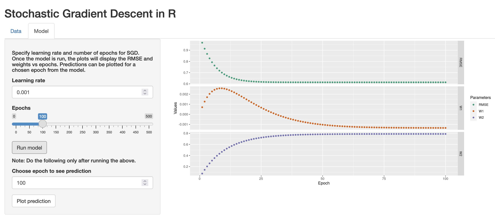

Recently I've been learning about optimization with gradient descent, and more specifically, stochastic gradient descent (SGD). I found it to be a little confusing at first so I created a Shiny app to help myself figure it out. 

Anyway, the basic gist of gradient descent is that you can take advantage of the property that the *sum of derivatives is equal to the derivative of a sum* and thereby avoid doing computationally intensive matrix multiplication with large data sets. For example, if we have a linear model of:

$$
Y = Xw
$$

where $Y$ is a vector of observations, i.e. $Y \in \mathbb{R}^{N}$, $X$ is matrix of input data s.t. $X \in \mathbb{R}^{N\text{x}D}$, and $w$ is a vector of parameters, $w \in \mathbb{R}^{D}$. $N$ being the number of observations and $D$ the number of parameters.

To solve the linear model, we could use the least-squares loss function to find $w$ to minimize the following:

$$
L(e) = ||e||^2 \\
e(w) = Y - Xw
$$

where $||e||$ represents the Euclidean norm of the error function $e$.

Or to think of it in non-matrix terms, find $w$ to minimize

$$
\sum_{n=1}^N (y_n - f(x_n;w))^2
$$

where $y_n$ is the $n^{th}$ observation $y$ and $f()$ is a function applied to the $n^{th}$ observation of $x$ using the parameters $w$ s.t. 

$$
f(x_n;w) = w_0 + w_1x_1 + ... + w_Dx_D
$$

for each observation.

Using the chain rule and desired derivatives (not going through the derivation here, but one great resource for the underlying math is @Deisenroth2020), we can solve for the derivative $\frac{dL}{dw}$,

$$
\frac{dL}{dw} = \frac{dL}{de}\frac{de}{dw} \\
= -2X^T(Y-Xw)
$$

Setting the derivative equal to zero and solving for $w$ produces

$$
w = (X^TX)^{-1}X^TY
$$

Which makes apparent that if these are large matrices the matrix computation can become expensive. Now we get to **stochastic gradient descent**.

Instead of using all the observations, we can update the vector of parameters $w$ incrementally using batches of samples, or even just one sample at a time. Here I'll show updating by one sample at a time over each iteration $i$:

$$
w_{i+1} = w_i + \gamma_i(\nabla L(w_i)) \\
w_{i+1} = w_i + \gamma_i(y_n - f(x_n,w))x_n
$$

using a step-size parameter $\gamma_i$. The step-size is chosen to not be too small that convergence takes too long, but not too large to *jump* over the optimal parameter values. As the error rate decreases, $w_i$ converges on the true value of $w$. That's the beauty of gradient descent. And also the crux point of confusion for me and why I made this Shiny app!

In the app, I code a simple implementation of SGD for a linear regression model. The parameters specifying the observed data can be manipulated, and so can the learning rate and number of epochs for SGD. After running the model, plots output the root mean square error, and the weights for the coefficients of the model (intercept and slope). It also plots the predicted versus observed y values for a given epoch, so the crappy performance at earlier epochs can be observed.

See the links at the top of the page for accessing code and the app.

### References
