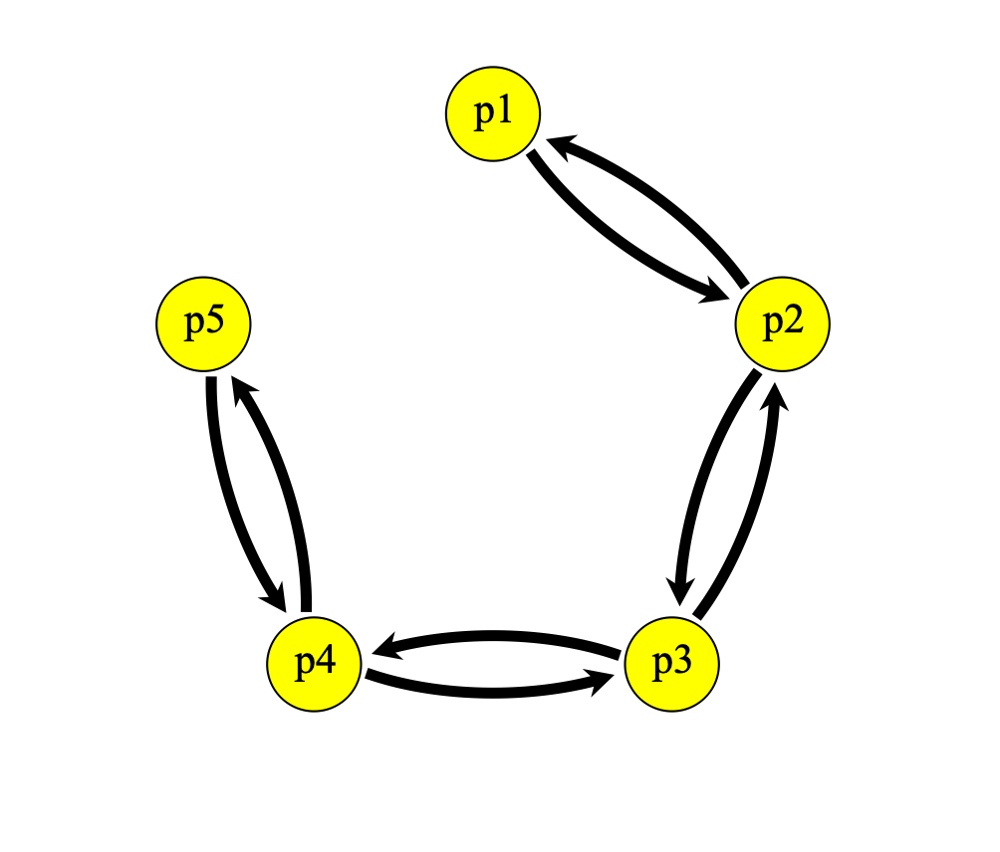

This project shows how to use neural networks to perform population assignment with genetic data. I test the neural network classification on genomic data simulated with SLiM3. For the most basic test, I simulated a 5 population stepping stone model (see below) with the following parameters:

* 500 individuals/population
* 1e-6 mutation rate
* 1 mb length genomic region
* 1e-8 recombination rate

I used an elevated mutation rate to quickly accumulate variants. Migration rate among connected populations was bidirectional and set at 0.1, 0.001, 0.00001 for high, medium, low levels of gene flow, respectively.

For each gene flow scenario, I provide samples of 1000 SNPs, filtered by 0.01 minor allele frequency, for 100 individuals from each population. The first column of the 500x1001 array designates the population ID. Genomic data were output after 10,000 generations.

