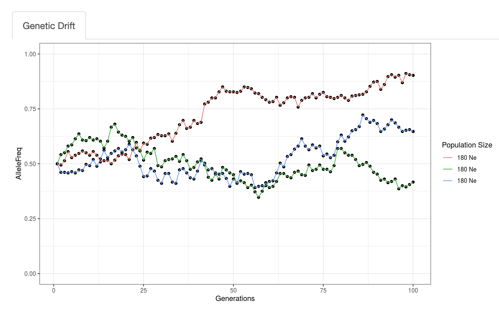

Interactive visualizations are a great way to better understand scientific concepts. I love creating [Shiny apps](https://shiny.rstudio.com/) in R to better understand concepts myself, as well as provide educational resources for students that, in addition to demonstrating a specific concept, are also informative coding resources.

Here, I provide an example of a Shiny app I created to model genetic drift. [Genetic drift](https://en.wikipedia.org/wiki/Genetic_drift) is a stochastic process by which population allele frequencies fluctuate over time do to random mating. Eventually, an allele will become fixed, at which point there is no changes in the frequency unless a mutation is induced. In this simulation, I allow users to change the effective population size for 3 different populations to show the random fluctuation, and how the probability of fixation increases with smaller effective population.

See the links at the top of the page for accessing code and the app.
